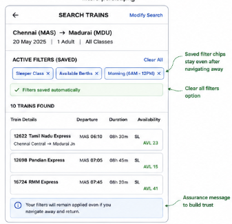
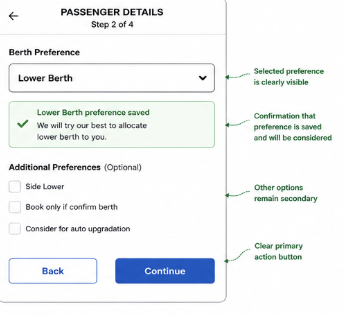
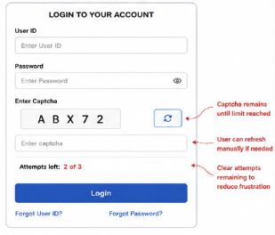
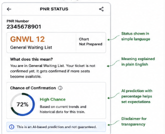
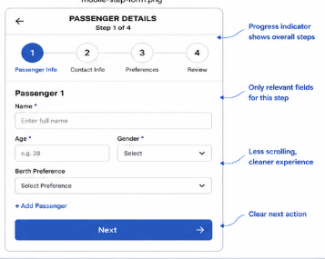

# Feature Spec 1: Tatkal Virtual Queue System

### Problem Statement

Part A identified that Tatkal booking frequently crashes during peak demand at 10 AM and 11 AM. Users experience loading loops, booking failures, and session expirations, causing them to lose booking opportunities.

### Current State (from Part A)

The failure occurs between booking submission and server processing. Thousands of users hit the same endpoint simultaneously, creating congestion and poor feedback.

### Proposed Solution

Instead of everyone competing at once, users enter a virtual queue before booking opens. The system displays queue position, estimated wait time, and booking readiness.

### Proposed User Flow

1. User selects Tatkal train.
2. User enters queue before booking opens.
3. System assigns queue number.
4. User sees live queue position.
5. User receives turn notification.
6. User gets 90 seconds to complete booking.
7. Booking proceeds normally.

### Technical Implementation Plan

**System Components Affected**

- Frontend
- Booking API
- Queue Service
- Notification Service

**New Data Requirements**

- Queue ID
- User ID
- Queue Position
- Entry Timestamp

**API Changes**

- POST /queue/join
- GET /queue/status
- POST /queue/complete

**Frontend Changes**

- Queue Position Card
- Countdown Timer
- Progress Bar

**Third Party Services**

- Redis for queue management

### Success Metrics

- Reduce booking failures by 60%
- Increase Tatkal completion rate
- Reduce refresh attempts

### Edge Cases

- User closes browser
- Network disconnect
- Queue timeout
- Duplicate sessions

---

# Feature Spec 2: Persistent Smart Filters

### Problem Statement

Part A identified that search filters such as Sleeper Class, Available Seats Only, and Departure Time frequently reset when users navigate away from search results. This forces users to repeatedly reapply filters and slows train discovery.

### Current State (from Part A)

The failure occurs when users open train details and return to search results. Previously selected filters are lost or applied inconsistently.

### Proposed Solution

The system automatically saves active filters during a search session. When users return to the search page, all selected filters remain applied and visible.

### Proposed User Flow

1. User searches trains.
2. User applies filters.
3. Filters are automatically saved.
4. User opens train details.
5. User returns to search results.
6. Previously selected filters remain active.
7. User continues browsing without reapplying filters.

### Technical Implementation Plan

**System Components Affected**
- Search Frontend
- Search API
- Session Storage

**New Data Requirements**
- Filter Preferences
- Session ID

**API Changes**
- GET /search/preferences
- POST /search/preferences

**Frontend Changes**
- Filter Persistence
- Saved Filter Chips
- Restore Search State

**Third Party Services**
- None

### Success Metrics

- Reduce filter reapplication rate by 80%
- Improve train search completion rate
- Reduce search abandonment

### Edge Cases

- Browser refresh
- Session expiration
- Shared devices

### Wireframe

---

# Feature Spec 3: Berth Preference Lock System

### Problem Statement

Part A identified that berth preferences selected by users are not consistently retained throughout the booking flow. Users are often unsure whether their Lower Berth, Upper Berth, or Side Lower preference has actually been saved, reducing trust in the booking experience.

### Current State (from Part A)

The issue occurs between the Passenger Details page and the Review Journey page. Users select a berth preference, but the preference may disappear or is not clearly visible on subsequent screens.

### Proposed Solution

The system visibly locks and confirms berth preferences immediately after selection. Users receive a clear confirmation message that their preference has been saved and will be considered during seat allocation.

### Proposed User Flow

1. User enters passenger details.
2. User selects berth preference.
3. System saves preference instantly.
4. Confirmation message appears.
5. User proceeds to review page.
6. Preference remains visible throughout booking.
7. Ticket confirmation includes berth preference record.

### Technical Implementation Plan

**System Components Affected**

* Passenger Details Module
* Booking API
* Ticket Review Screen

**New Data Requirements**

* Berth Preference Status
* Preference Timestamp

**API Changes**

* PATCH /booking/berth-preference
* GET /booking/preferences

**Frontend Changes**

* Saved Preference Badge
* Confirmation Banner
* Preference Summary Card

**Third Party Services**

* None

### Success Metrics

* Reduce berth-related complaints by 50%
* Increase booking confidence score
* Reduce review-page back navigation

### Edge Cases and Constraints

* Multiple passengers with different preferences
* Preference unavailable due to train occupancy
* Auto-upgradation conflicts
* Graceful fallback when berth preference cannot be honored

### Wireframe

---

# Feature Spec 4: Smart Captcha Recovery

### Problem Statement

Part A identified that users must repeatedly solve new captchas after login failures. This creates unnecessary friction and increases login abandonment.

### Current State (from Part A)

The captcha refreshes immediately after failed login attempts, forcing users to repeatedly solve new challenges.

### Proposed Solution

Allow users up to three attempts before forcing a captcha refresh. Add a manual refresh option and attempt counter to improve recovery from login errors.

### Proposed User Flow

1. User enters username and password.
2. User enters captcha.
3. Login fails.
4. Existing captcha remains active.
5. User retries authentication.
6. Attempt counter updates.
7. New captcha appears only after maximum attempts.

### Technical Implementation Plan

**System Components Affected**

* Login Service
* Authentication API
* Captcha Service

**New Data Requirements**

* Captcha Attempt Count
* Session Tracking Data

**API Changes**

* POST /auth/login
* GET /captcha/refresh

**Frontend Changes**

* Attempt Counter
* Manual Refresh Button
* Error Recovery Messaging

**Third Party Services**

* Existing Captcha Provider

### Success Metrics

* Reduce login abandonment by 30%
* Improve login completion rate
* Reduce unnecessary captcha refreshes

### Edge Cases and Constraints

* Brute-force attack prevention
* Session expiration
* Shared computer environments
* Captcha service downtime

### Wireframe

---

# Feature Spec 5: PNR Status Explanation Panel

### Problem Statement

Part A identified that railway abbreviations such as WL, RAC, GNWL, and RLWL are difficult for many users to understand. This forces users to leave IRCTC and search external sources.

### Current State (from Part A)

PNR status pages display technical railway codes without sufficient contextual explanation or guidance.

### Proposed Solution

Add a smart explanation panel that converts railway terminology into plain language and provides helpful travel guidance.

### Proposed User Flow

1. User enters PNR number.
2. PNR status loads.
3. System detects status code.
4. Explanation panel appears.
5. Meaning is displayed in simple language.
6. User understands status immediately.
7. User remains within IRCTC ecosystem.

### Technical Implementation Plan

**System Components Affected**

* PNR Module
* Railway Status API
* User Interface Layer

**New Data Requirements**

* Status Dictionary Database
* Explanation Metadata

**API Changes**

* GET /pnr/explanation

**Frontend Changes**

* Status Explanation Card
* Tooltip Support
* Confirmation Probability Widget

**Third Party Services**

* Optional Prediction Engine

### Success Metrics

* Reduce external help searches
* Increase PNR page engagement
* Improve user comprehension scores

### Edge Cases and Constraints

* Rare railway status codes
* Missing status information
* API response delays
* Multi-language support requirements

### Wireframe

---

# Feature Spec 6: Multi-Step Mobile Booking Form

### Problem Statement

Part A identified that the mobile booking form requires excessive scrolling and contains too many fields on a single page. This increases form errors and booking abandonment.

### Current State (from Part A)

Users complete a long single-page form containing passenger details, preferences, and contact information before proceeding.

### Proposed Solution

Break the booking process into four smaller steps with a visible progress indicator and automatic draft saving.

### Proposed User Flow

1. User opens booking form.
2. Step 1: Passenger Information.
3. Step 2: Contact Information.
4. Step 3: Travel Preferences.
5. Step 4: Review and Confirm.
6. Progress indicator updates after each step.
7. Booking is completed successfully.

### Technical Implementation Plan

**System Components Affected**

* Mobile Frontend
* Booking API
* Session Storage

**New Data Requirements**

* Step Progress State
* Draft Booking Data

**API Changes**

* POST /booking/save-draft
* GET /booking/draft

**Frontend Changes**

* Multi-Step Form Layout
* Progress Tracker
* Auto Save Mechanism

**Third Party Services**

* None

### Success Metrics

* Reduce form abandonment by 40%
* Reduce validation errors
* Increase mobile booking completion rate

### Edge Cases and Constraints

* User closes browser mid-booking
* Network interruptions
* Draft expiration
* Multiple passenger bookings

### Wireframe

